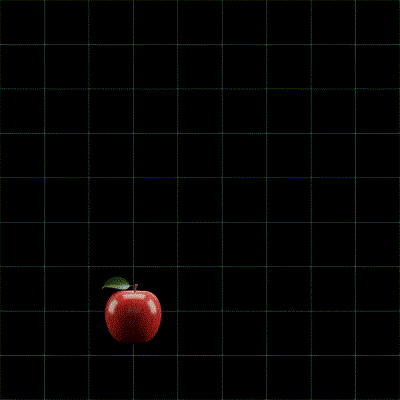

# Lab 1

#### What is a unit of distance (length)?

  

  
Answer

  It's a quantity like a **meter** that represents some agreed-upon fixed distance.

  Any unit of distance may be used, as long as its value is fixed.

  Other examples: kilometer, yard, foot.
  

  

  
Units of distance in games

  In games, **pixels** are often used to represent distances.

  Also, engines like Unity have their own coordinate systems.
  It is common in 3D games to match the size of 3D models to this coordinate system, 
  assuming 1:1 ratio of **1 unit in Unity to 1 real-world meter**.

  One can make their own coordinate systems, in which a different unit is used.
  For example, if you're making a 2D grid game, you'd typically use the **cell size** as the unit of distance.
  "Cell size" is the abstraction that allows other things in the game to depend on it, 
  rather than on ditances from Unity or from the real world.
  

#### What is a unit of time?

  

  
Answer

  Just like with distance, it's something like a second or a minute.
  

  

  
Units of time in games

  **A frame** is the time that passes between rerenders of the screen.
  It depends on the **framerate**, which is typically $`1/30`$ or $`1/60`$ of a second.
  
  However, a frame is not strictly a unit of measurement, because it is not fixed.
  One frame of game might rerender slower than another, making the time between frames longer.

  It is typically not recommended for physics simulations, in favor of **a fixed time step** or **a tick**.
  Ticks are independent of the framerate and are not universal.
  They are defined within a particular game.
  

#### What is speed?

  

  
Answer

  Speed means how many **units of distance** does the object travel in a **unit of time**.
  

#### What is velocity?

  

  
Answer

  Velocity is speed in a certain direction.
  

#### Suppose an object is moving through space with some velocity. How would you go about communicating the fact that the velocity goes in a direction?

  

  
Answer 1 (decomposition)

  Velocity can be decomposed into its **components**, and each component can be treated separately.
  In 2 dimensions, velocity can be represented using an `x` component and a `y` component.

  For example, a velocity with components `x = 1` and `y = 3`, per second,
  means that the object will travel **by 1 unit of distance in `x`, and by 3 units of distance in `y` every second**.

  
  

  

  
Answer 2

  The `x` and `y` components can be treated as a single velocity vector.
  

  

  
Answer 3

  The following is a *very common idea* in games.

  The velocity can be treated as a **direction** vector and a **speed** scalar.
  **The direction vector has a length of 1 and when multiplied by the speed scalar gives the velocity vector.**

  The point of direction being normalized (having length of 1) 
  is **so that** it gives the velocity vector when multiplied by speed.

  
  

#### How to get the speed and the direction from a velocity vector?

  

  
Answer (speed)

  The speed is just the **length** of the velocity vector.
  It can be computed using pythagorean theorem, $` \left|\vec{v}\right| = \sqrt{x^2 + y^2} `$.

  
  

- If you have a character that is **located at some point in space** 
  and is **moving in some direction** with some **velocity**,
  how do you represent this situation using vectors and/or scalars?

  

  
Primitive solution

  You could represent all of your values as scalars:
  - The `x` coordinate of the character;
  - The `y` coordinate of the character;
  - The `x` component of velocity (how many meters the character will move in the `x` direction in a second);
  - The `y` component of velocity;
  

