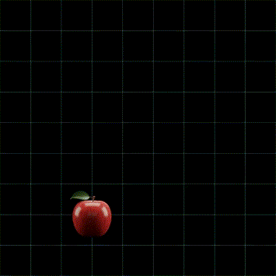
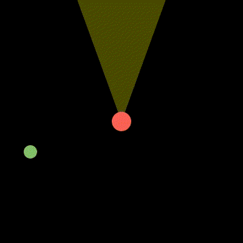

# Lab 1

## Concepts to know

1. Vectors
2. Operations with vectors
    - addition
    - subtraction
    - length of vector
    - dot product (projection)
3. Unit vectors, normalization
4. 2D Rotations (special case of linear transformations)
5. Linear interpolation
6. [Line parametrization](https://mathinsight.org/line_parametrization)

Main resource:
- [3Blue1Brown course](https://www.youtube.com/watch?v=fNk_zzaMoSs&list=PLZHQObOWTQDPD3MizzM2xVFitgF8hE_ab)


## Practice

Solve practice problems from all these sources:
- [Basics](https://tutorial.math.lamar.edu/Problems/CalcII/Vectors_Basics.aspx)
- [Arithmetic](https://tutorial.math.lamar.edu/Problems/CalcII/VectorArithmetic.aspx)
- [Dot Product](https://tutorial.math.lamar.edu/Problems/CalcII/DotProduct.aspx)

Each of these includes notes.

## Questions you should be able to answer

#### What is a unit of distance (length)?

<details>
<summary>Answer</summary>

It's a quantity like a **meter** that represents some agreed-upon fixed distance.

Any unit of distance may be used, as long as its value is fixed.

Other examples: kilometer, yard, foot.
</details>

<details>
<summary>Units of distance in games</summary>

In games, **pixels** are often used to represent distances.

Also, engines like Unity have their own coordinate systems.
It is common in 3D games to match the size of 3D models to this coordinate system, 
assuming 1:1 ratio of **1 unit in Unity to 1 real-world meter**.

One can make their own coordinate systems, in which a different unit is used.
For example, if you're making a 2D grid game, you'd typically use the **cell size** as the unit of distance.
"Cell size" is the abstraction that allows other things in the game to depend on it, 
rather than on ditances from Unity or from the real world.
</details>

---
#### What is a unit of time?

<details>
<summary>Answer</summary>

Just like with distance, it's something like a second or a minute.
</details>

<details>
<summary>Units of time in games</summary>

**A frame** is the time that passes between rerenders of the screen.
It depends on the **framerate**, which is typically $`1/30`$ or $`1/60`$ of a second.

However, a frame is not strictly a unit of measurement, because it is not fixed.
One frame of game might rerender slower than another, making the time between frames longer.

It is typically not recommended for physics simulations, in favor of **a fixed time step** or **a tick**.
Ticks are independent of the framerate and are not universal.
They are defined within a particular game.
</details>

---
#### What is speed?

<details>
<summary>Answer</summary>

Speed means how many **units of distance** does the object travel in a **unit of time**.
</details>

---
#### What is velocity?

<details>
<summary>Answer</summary>

Velocity is speed in a certain direction.
</details>

---
#### Suppose an object is moving through space with some velocity. 

How would you go about communicating the fact that the velocity goes in a direction?

<details>
<summary>Answer 1 (decomposition)</summary>

Velocity can be decomposed into its **components**, and each component can be treated separately.
In 2 dimensions, velocity can be represented using an `x` component and a `y` component.

For example, a velocity with components `x = 1` and `y = 3`, per second,
means that the object will travel **by 1 unit of distance in `x`, and by 3 units of distance in `y` every second**.


</details>

<details>
<summary>Answer 2</summary>

The `x` and `y` components can be treated as a single velocity vector.
</details>

<details>
<summary>Answer 3</summary>

The following is a *very common idea* in games.

The velocity can be treated as a **direction** vector and a **speed** scalar.
**The direction vector has a length of 1 and when multiplied by the speed scalar gives the velocity vector.**

The point of direction being normalized (having length of 1) 
is **so that** it gives the velocity vector when multiplied by speed.


</details>

---
#### How to get the speed and the direction from a velocity vector?

<details>
<summary>Answer (speed)</summary>

The speed is just the **length** of the velocity vector.
It can be computed using pythagorean theorem, $` \lvert \vec{v} \rvert = \sqrt{x^2 + y^2} `$.


</details>

---
#### How to represent a character?

If you have a character that is **located at some point in space** 
and is **moving in some direction** with some **velocity**,
how do you represent this situation using vectors and/or scalars?

<details>
<summary>Primitive solution</summary>

You could represent all of your values as scalars:
- The `x` coordinate of the character;
- The `y` coordinate of the character;
- The `x` component of velocity;
- The `y` component of velocity;

```cpp
struct Character
{
    float x_position;
    float y_position;
    float x_velocity;
    float y_velocity;
};
```

To update the current position with the movement, do:

```cpp
void update(Character& c)
{
    c.x_position += c.x_velocity;
    c.y_position += c.y_velocity;
}
```

Getting the velocity direction has to be done manually by normalizing each component:

```cpp
void get_velocity_direction(const Character& c, float& x_output, float& y_output)
{
    const float x = c.x_velocity;
    const float y = c.y_velocity;
    const float len = sqrt(x * x + y * y)
    x_output = x / len;
    y_output = y / len;
}
```
</details>

<details>
<summary>Solution with vectors</summary>

- The position vector
- The velocity vector

Game libraries commonly provide a vector abstraction,
called `v2` or `Vector2` or similar.
It usually has functions or overloaded operators for addition, subtraction, scaling, length, dot product, etc.

```cpp
struct v2
{
    float x;
    float y;
};
```

```cpp
struct Character
{
    v2 position;
    v2 velocity;
};

void update(Character& c)
{
    c.position += c.velocity;
}

void get_velocity_direction(const Character& c)
{
    return c.velocity.normalized();
}

void get_speed(const Character& c)
{
    return c.velocity.magnitude(); // magnitude = length
}
```
</details>

<details>
<summary>Separate speed and velocity direction</summary>

- The position vector
- The velocity direction vector (or just direction)
- The speed

```cpp
struct Character
{
    v2 position;
    v2 direction;
    float speed;
};

void update(Character& c)
{
    c.position += get_velocity(c);
}

void get_velocity(const Character& c)
{
    return c.speed * c.direction;
}
```
</details>


---
#### Enemy detection

Suppose an enemy is looking forward.
It has an angle of player detection.
Say, it is 40 degrees.

How would you go about finding if it can see the player, 
given the position of the enemy, 
the direction it's looking,
and the player's position?



<details>
<summary>Answer</summary>


Use dot product for this.

First, compute the vector from the enemy ($` E `$) to the player ($` P `$), call it $` v `$.

$` \vec{v} = P - E `$

Second, get the direction of where the enemy is looking ($` \hat{d} `$) and the angle from the question ($` \beta `$)

Then, recall the dot product identity:

$` \vec{a} \cdot \vec{b} = \lvert \vec{a} \rvert \lvert \vec{b} \rvert cos(\alpha) `$

where $` \alpha `$ is the angle between the vectors.

When used for $` \hat{d} `$ and $` \vec{v} `$, we get the following:

$` \hat{d} \cdot \vec{v} = \lvert \hat{d} \rvert \lvert \vec{v} \rvert cos(\alpha) `$

Since $` \hat{d} `$ is a unit vector, we can simplify it further to:

$` \lvert \hat{d} \rvert \lvert \vec{v} \rvert cos(\alpha) = 1 \lvert \vec{v} \rvert cos(\alpha) = \lvert \vec{v} \rvert cos(\alpha) `$

And then rearrange to isolate $` cos(\alpha) `$:

$` cos(\alpha) = \frac{\hat{d} \cdot \vec{v}}{|\vec{v}|} `$

$` cos(\alpha) `$ gets smaller with larger angles.
So we need it to be larger than $` cos(\frac{\beta}{2}) `$ for the player to be in the visibility zone.
</details>


How do you limit the maximum distance that the player is detectable?

<details>
<summary>Answer</summary>

Just compute the distance to the player.
This is done by computing the length of $` \vec{v} `$, 
which can be done by doing using the pythagorean theorem like discussed before.

Then, just check that the distance is smaller than the max distance.
</details>


---
#### In what direction does the enemy need to move to reach the player

<details>
<summary>Answer</summary>

$` E `$ is the position of the enemy, $` P `$ is the position of the player.

$` \vec{v} = P - E `$ is the vector from the enemy to the player.
If you were to add this vector to the enemy's position,
aka **move** the enemy by $` \vec{v} `$, it is going to end up at the player's position.

The direction is just this vector normalized:
$` \hat{d} = \frac{\vec{v}}{|\vec{v}|} `$
</details>

---
#### Line segment as an interpolation between two points

If you have a starting ($` S `$) and an ending ($` E `$) position vectors of an object,
how would you go about animating a smooth translation of it between those two points,
spread over $` t_0 `$ seconds (say, $` t_0 = 2 `$),
with each new position drawn each frame of the game?

<details>
<summary>Interpolation</summary>

**Interpolation** is the technique you'd usually use to solve this problem.

The basic idea is that you'd define a vector-valued function $` f(t) `$,
which is going to be called each frame to determine 
the visual position of the object in that frame.
$` t `$ in that function is the **time passed since the movement started**.

At $` t = 0 `$, the object is going to be at $` S `$, denoted as $` f(0) = S `$.
At $` t = t_0 `$, it's going to be at $` E `$, denoted as $` f(t_0) = E `$.

You can choose what's going to happen in between to smooth out the movement.
</details>

<details>
<summary>Linear interpolation</summary>

**Linear interpolation** is the simplest way to solve this problem.

The idea is to use a function that changes *linearly*,
which basically means that the movement is going to happen with the same speed
for the whole animation.
So, at $` t = \frac{t_0}{2} `$, the position is going to be right 
in the middle of the two points.

At $` t = \frac{t_0}{3} `$, it's going to be $` \frac{1}{3} `$rd of the way 
from $` S `$ to $` E `$.

To simplify the computations, $` t `$ is usually rescaled to the interval $` [0, 1] `$ first.
Let's call it $` p = \frac{t}{t_0} `$.
Now, $` p `$ kind of represents **the portion of the way** from $` S `$ to $` E `$. 

Then, define $` f(t) `$ through $` g `$:

$` f(t) = g(\frac{t}{t_0}) `$

<details>
<summary>Interpretation - combination of 2 points</summary>

Loosely speaking, we take $` p `$ of the first point, and take the rest ($` 1 - p `$) 
of the second point, and kinda add that together.

So you get the following:

$` g(p) = p \vec{S} + (1 - p) \vec{E} `$
</details>

<details>
<summary>Interpretation - scaling a vector between endpoints</summary>

The idea is to find the vector $` \vec{v} `$ going from $` S `$ to $` E `$.
Then, scale it by $` p `$ and attach it to $` S `$.

At $` p = 0 `$, you'd get $` S `$, because you'd not be moving from the starting point.

At $` p = 1 `$, you'd get $` E `$, because you'd move from $` S `$ 
by the whole $` \vec{v} `$ to $` E `$.

At $` p = \frac{1}{2} `$, you'd move by half of $` \vec{v} `$ 
giving you the point between the two, exactly.

$` \vec{v} = \vec{E} - \vec{S}`$

$` g(p) = p \vec{v} + \vec{S} `$

This is equivalent to the "combination of 2 points" interpretation:

$` p \vec{v} + \vec{S} = \\\\ p (\vec{E} - \vec{S}) + \vec{S} = \\\\ p \vec{E} - p \vec{S} + \vec{S} = \\\\ p \vec{E} + (1 - p) \vec{S} `$
</details>

</details>

<details>
<summary>Code</summary>

```cpp
v2 getAnimatedPosition(
    v2 startPosition, // S
    v2 endPosition, // E
    float timeSinceStart, // t
    float completionTime) // t_0
{
    assert(completionTime > 0);

    float p = timeSinceStart / completionTime;
    v2 ret = startPosition * p + endPosition * (1 - p); 
    return ret;
}
```

</details>

---

#### Capping the speed of an object

Say, an object is moving with some velocity $` \vec{v} `$.

How do you make it so that the speed is capped at some value, say $` 5 `$?

> In games, **capping** means limiting the value to some maximum.
> So, if the speed is capped at $` 5 `$, that means it cannot exceed $` 5 `$.
> If it ever gets larger than $` 5 `$, it just gets scaled back to $` 5 `$.

<details>
<summary>Answer</summary>

You do this by **capping the speed** (the magnitude of velocity) 
before applying the movement.

The goal is to find a vector that points in the same direction as $` \vec{v} `$,
but has a length no longer than $` 5 `$.

The idea is to first check if the length of $` v `$ is already below limit.
In case it isn't, only then should it be set to $` 5 `$.

Next, find the unit vector pointing in the same direction as $` v `$.
Next, rescale that vector to $` 5 `$.

Expressed as a function:
```cpp
v2 cap_speed(v2 velocity, float maxValue)
{
    float speed = velocity.magnitude();
    if (speed <= maxValue)
    {
        return velocity;
    }

    v2 direction = velocity * (1.0f / speed);
    v2 ret = direction * maxValue;
    return ret;
}
```
</details>
