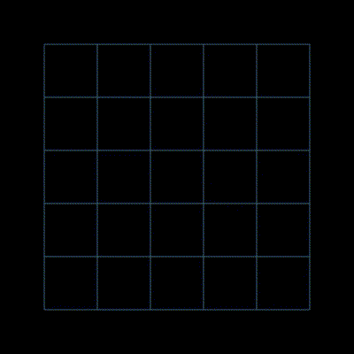
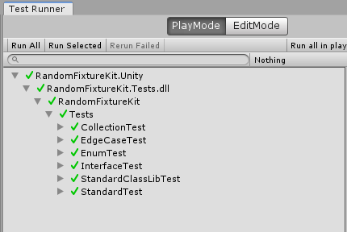
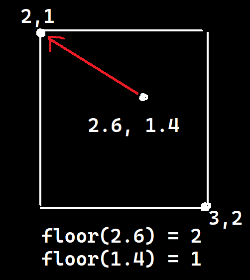
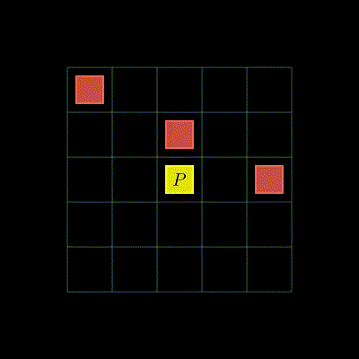
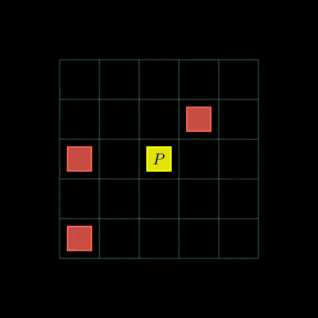
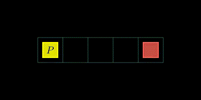

# Grid 2D physics simulations

## Quick plan

1. Integer movement, turn-based mechanics
2. Detecting collisions with walls, other objects
3. Using vectors to reduce code duplication
4. Enabling smooth movement (movement animation)
5. 2D raycasts
6. Optimization techniques:
    - Uniform grid / spatial hash
    - Geometry separation (static, dynamic)

## Game engine or framework recommendations

I'd say there are the following kinds of frameworks / game engines:
- **Minimalist**, very high-level (pygame, p5, Processing);
- **Adaptive**, can be either high or low level (raylib);
- **Heavy** (Unity, UE).

*Pygame, p5 and Processing* operate kind of like this:
- You have an update function or a draw loop, that gets called each frame;
- You draw stuff manually directly to the screen, using functions such as `rect` and `circle`;
- You handle events using helper functions (`onMouseDown`) or by means of a switch-case (in pygame).

*Raylib* can be used in a similar fashion, but it is by design easier to adapt 
to lower-level tasks, like custom geometry, shaders.

*Unity/UE* doesn't give you direct control over the control-flow like the other types of frameworks,
instead forcing you to work within its editor and environment.
There is no main function, you don't create the objects: 
the game engine does, and it has complex rules of the order it calls your scripts.
Nonetheless, the editor is a powerful tool, 
even though it comes with a lot of "stuff" most of
which you might never use.

## Coordinate systems

**The course will be illustrated in Unity, but you may use any framework you want.**

[More about coordinate systems and projections in the context of OpenGL](https://learnopengl.com/Getting-started/Coordinate-Systems).

### Grid, cells, coordinates

When equally sized cells are arranged one next to the other, without gaps, it's called a grid. 


Each cell has a coordinate.
In 2d games the top-left cell usually has coordinates $` x=0, y=0 `$, 
with $` x `$ growing to the right, and $` y `$ growing downwards.
The size of a cell is usually exactly $` 1 `$.
This makes it easy to know the coordinates of any one cell.



### Screen coordinates

When drawing to the screen, **screen coordinates** are used,
also called **coordinates in screen space**.
These are the **pixel coordinates** of things drawn to the screen.

Screen coordinates also start at $` 0,0 `$ in the top left,
with x growing to the right and y growing downwards.

In order to display a cell, it is not enough to only have its coordinates.
It is also necessary to at least know the 
**mapping from grid to screen coordinates**.

### Coordinate systems in minimal frameworks

In minimal frameworks, you typically draw to the screen directly, in screen space,
without having to go through the world space, like you do in Unity (described later).

The top-left corner of the screen in these libraries has coordinates $` 0,0 `$,
and they grow towards the bottom-right corner of the screen.
It works just like in grid space, the only difference is that 
**the distance units are pixels, rather than cells**.

Since the data in the program is stored in grid space,
while the rendering happens in screen space,
the programmer has to **manually map coordinates from grid space to world space**.

Luckily, it's very easy to implement in this setup, because the coordinates start 
at the same point and the axes are not reversed.
One has to simply **multiply by the cell size in pixels**.
This is sort of like stretching each cell by its size in pixels.

$` p_{S} = p_{G} * s `$, where:
- $` p_{S} `$ are the screen coordinates;
- $` p_{G} `$ are the grid coordinates;
- $` s `$ is the scaling factor — how many pixels should a cell be wide.

### World coordinates in Unity

In heavier libraries like Unity,
the cells will have to go through another coordinate space, the **world space**,
before reaching the screen space.

**Grid space** (code) $` \rightarrow `$ 
**World space** (Unity scene) $` \rightarrow `$
**Screen space** (pixels on screen)

The world space coordinates are how objects are placed in the scene.
It really does not matter what positions the objects are going to have
in the world space, as long as 
**there is a mapping to and from the grid space into the world space**,
because you'll always be able to restore one from the other.

#### Grid to World

Since we can choose any mapping, as long as it's defined,
the most logical idea would be to choose the **simplest**.

However, there is one problem:
the y-coordinate in world space **grows upwards** instead of downwards,
which complicates the mapping a bit.

The simplest mappings I could think of, 
taking into account the flipping of y, 
is to put the cells at `h - y - 1`, or at `-y` (`h` is the grid height).

Note that the cells are usually set to start at their top-left corner.
That is **position $` x=0, y=0 `$ in grid space is the position of the top-left 
corner of the top-left cell**. The cell **starts** at $` 0,0 `$ but keeps going until $` 1,1 `$


Since in Unity the positions are 3-dimensional, 
the Z should be set to any fixed value, like 0.
It's a 2D game, the Z does not matter.

#### World to Grid

Just reverse the mapping by solving for the unknown variable.
For example:

$` y_W = h - y_G - 1 `$

$` y_W + y_G = h - y_G - 1 + y_G `$

$` y_W + y_G = h - 1 `$

$` y_W + y_G - y_W = h - 1 - y_W `$

$` y_G = h - y_W - 1  `$

The Z coordinate can be dropped entirely.

#### World to Screen

In Unity, this is what the camera does.
The key idea to understand here is the **projection**.

In 3D games, the **perspective** projection is used.
It models the real world: objects further from 
the camera look smaller on the screen.

In 2D games, the **orthographic** projection is usually used.
Here, no matter how far the objects are from the camera, 
they look the same size.
This is perfect for a grid, where we don't want the cells to get distorted.

Orthographic projection is defined by a box around the camera,
which will be projected onto the screen.

#### Screen to World

`Camera` has a method that applies **the inverse of its projection**,
`ScreenToWorldPoint`.
It does not restore the `z`, 
because it's not possible with projections,
which deliberately discards information.
But the `z` may be ignored, because we only care about the 2D coordinates.


## Unity setup

### Packages/manifest.json

This file contains the packages used by the project.
By default, it contains a whole bunch of stuff, 
most of which we won't be using for this demo.

Only keep these lines in it:
```json
{
  "dependencies": {
    "com.unity.modules.animation": "1.0.0",
    "com.unity.2d.sprite": "2.0.1",
    "com.unity.ide.rider": "3.0.31",
    "com.unity.ide.visualstudio": "2.0.22",
    "com.unity.test-framework": "1.4.5"
  }
}
```

- `com.unity.modules.animation` is needed for a dependency we'll add later.
- `com.unity.2d.sprite` is needed to display 2D images.
- `com.unity.ide.*` packages are, naturally, for IDE integration.
- `com.unity.test-framework` is for doing unit tests that we'll 
  use to validate features and refactor code.

### Setting up objects with code

Did you know that you can run your code outside of play mode in the editor?
You can do this by using 
[`[ContextMenuItem]`](https://docs.unity3d.com/6000.3/Documentation/ScriptReference/ContextMenuItemAttribute.html), 
making 
[a custom editor](https://docs.unity3d.com/540/Documentation/Manual/editor-CustomEditors.html),
or using [Odin Inspector](https://odininspector.com/visual-designer-getting-started).
While using Odin would be great, it's not free.

Luckily, there is a minimal free library 
[NaughtyAttributes](https://github.com/dbrizov/NaughtyAttributes) 
that adds similar functionality.
I'll be using it to make buttons appear in the inspector.

Install it by adding this line to `Packages/manifest.json`
```
"com.dbrizov.naughtyattributes": "https://github.com/dbrizov/NaughtyAttributes.git#upm"
```

### Undo

[The Undo system](https://docs.unity3d.com/6000.3/Documentation/ScriptReference/Undo.html) 
in Unity serves two purposes:
1. Allows managing the undo history via scripts;
2. Marks objects as dirty, so they are saved the next time you hit `CTRL+S`.
   Yes, they might not be saved unless you mark them as dirty 
   with `EditorUtility.SetDirty()` or by using the undo system.

An important thing to be noted is that **the Undo system may only be used in Editor code**.
You have to be careful to only use it in scripts that are editor-only.

### Automated tests

#### Assembly definitions (`asmdef`s)

In Unity, automated tests can only be done on code placed in a separate `asmdef`.
`asmdef`s are like the `csproj` files in .NET, with a few notable differences:
- They are JSON's, not XML;
- They have unity-specific semantics (like `noEngineReferences`, `includePlatforms`, etc.);
- References to other `asmdef`s may either be done using guids or names.

> `asmdef`s are like isolated units of code that can reference other `asmdef`s, 
> but can't have circular references of their dependencies pointing back to themselves.

Here's an assembly defition file (`asmdef`),
which can also be created from within the Unity Editor.

```json
{
    "name": "PutAnythingHere",
    "references": [],
    "includePlatforms": [],
    "excludePlatforms": [],
    "allowUnsafeCode": false,
    "overrideReferences": false,
    "precompiledReferences": [],
    "autoReferenced": true,
    "defineConstraints": [],
    "versionDefines": [],
    "noEngineReferences": false
}
```

Only the `name` field is relevant, 
the others may be omitted, 
in which case they'd have the default values as indicated in the example.

#### Setting up tests

The tests must be put in a folder containing an `asmdef` JSON.
In order to get the testing utilities, one must have the following in the `asmdef`:

```json
{
    "name": "MyTests",
    "references": [
        "AssemblyNameUnderTest"
    ],
    "optionalUnityReferences": [
        "TestAssemblies"
    ]
}
```

Tests are instance functions maked with `[Test]` inside a class,
where you'd validate if your functions from the game work correctly.

```cs
using NUnit.Framework;

public class CalculatorTests
{
    [Test]
    public void Add_ReturnsCorrectSum()
    {
        int result = 2 + 3;

        Assert.AreEqual(5, result);
    }

    [Test]
    public void Division_ByZero_ThrowsException()
    {
        Assert.Throws<System.DivideByZeroException>(() =>
        {
            int x = 10 / int.Parse("0");
        });
    }
}
```

You may also have play mode tests, 
which allow to spawn objects into a scene.

```cs
using NUnit.Framework;
using UnityEngine;
using UnityEngine.TestTools;
using System.Collections;

public class GameObjectTests
{
    [UnityTest]
    public IEnumerator GameObject_IsCreated()
    {
        var go = new GameObject("TestObject");

        yield return null; // wait one frame

        Assert.IsNotNull(go);
        Assert.AreEqual("TestObject", go.name);

        Object.Destroy(go);
    }
}
```

#### Running the tests

Tests can be run by using the **Test Runner** in Unity Editor,
which can be accessed by clicking `Window → General → Test Runner`.



### .editorconfig

This file is used to keep the programmer from using patterns disallowed by the compiler in Unity.

Currently, I'm preventing block-scoped namespace declarations.
In Unity, if you do the following, script assets start serializing incorrectly.
```cs
namespace Sample;
```

You have to do this:
```cs
namespace Sample
{
}
```

The explicit rule sets the first syntax as an error in the IDE.

### Configuring the compiler flags

It's always a good idea to enable nullability checks and set the language version to a newer version.
In Unity, you do this by placing a `csc.rsp` file in `Assets` with the following:
```
-langversion:10
-nullable:enable
```

### `UNITY_EDITOR` constant

`#if UNITY_EDITOR` preprocessor check can be used to disable parts of code
that are meant for use within the editor only.
The code will not compile for release if you leave in calls to functions that are only available in the editor.

Alternatively, if the whole file is designed for just editor use, 
you can put it in an `asmdef` with this configuration:
```json
{
    "includePlatforms": [ "Editor" ]
}
```

Do, however, note that if you make a `MonoBehavior`-derived class and put it in an editor-only `asmdef`,
you won't be able to add it to an object from the editor.
It just won't show up in the component dropdown.

### Removing objects or components from build

If you're feeling like having editor-only components is not valid,
because they will break the build, you're not completely right.

You can add flags to a game object or to a component to hide it from builds:
```cs
gameObject.hideFlags = HideFlags.DontSaveInBuild;
component.hideFlags = HideFlags.DontSaveInBuild;
```

It is also possible to strip an object from builds completely
by setting the tag of a game object to `EditorOnly`.

## Grid space operations

The grid coordinate space is just the most basic building block.
Any useful mechanics will be derived by building abstractions on top of it.

### Finding the cell coordinates from any point in grid space

Let's recall the basic facts about a cell:
- Any cell is a square, and the side lengths of all cells are the same, usually 1;
- The cell coordinates are the coordinates of its top-left corner;
- Cell with coordinates $` x, y `$ continues until $` x + 1, y + 1 `$ (its bottom-right corner).

By using the fact that the cell contains all points from its $` x, y `$ to $` x + 1, y + 1 `$,
it's easy to determine the $` x, y `$ having any point from the range —
just round it down each of its coordinates (the `floor` function).
This is going to effectively **snap** any position to its closest cell.

Here's an illustration:


### Finding the coordinate of the center of the cell

In order to find the center of a cell, 
we just need to add the half-size vector to its top-left position,
in grid space.
The half size vector is $` \frac{1}{2}, \frac{1}{2} `$.

However, if your goal is to do this in world space 
using the idea of flipping the $`y`$ by this formula $` y_W = h - y_G - 1 `$, 
since $`y`$ is going to change its sign,
the vector is going to become $` \frac{1}{2}, -\frac{1}{2} `$.

> You could think of deriving this as assuming $`h = 1`$, because we're
> considering the whole grid to be the single cell for this operation,
> and substituting $` \frac{1}{2} `$ for $`y_G`$ gets you 
> $` y_W = 1 - \frac{1}{2} - 1 = -\frac{1}{2}`$

> When positioning a cell in Unity, 
> you might need to offset it if you're using the default Square model.
>
> If you're adjusting the positioning on prefab basis, 
> it's going to have to be in world coordinates.
>
> Another way would be to make a square mesh with its origin in the top-left corner
> (probably the cleanest),
> or by offsetting it in grid space before mapping its position to world space.

### Checking if a point is off-grid

The key idea to understand to think through this operation is that
you can **view the x and the y coordinates separately**.
A point is going to be within the grid if 
**both its x and y are within the grid's x and y range**

Now, how do you check if the coordinate is in a range?
Simply by checking the endpoints (the start and end of the range).
The point has to be after the start but before the end.

Since we set the start of our grid to $` 0,0 `$,
the **starts of both x and y ranges will be at 0**.
The ends are going to be at width ($` w `$) and height ($` h `$) respectively,
because cells continue until the bottom-right corner, 
which has the position of $` w, h `$.

So the formula that comes out is:
$` x >= 0 `$ and $` x < w `$ and $` y >= 0 `$ and $` y < h `$.

You can also simplify this somewhat and work with integers 
(cell coordinates, rather than just grid coordinates),
by snapping to the start of the cell beforehand.
Then the checks stay the same but use integer comparisons.

### Cells adjacent to a cell

Just try adding the vectors indicating the desired offsets to the cell position.
The offset may be up, down, left or right.
The vectors for these are $` 0, -1 `$, $` 0, 1 `$, $` -1, 0 `$ and $` 1, 0 `$.

If you also want the diagonals, 
you have all combinations of $` -1 `$, $` 1 `$ and $` 0 `$ available for 8
total offset vectors.

### Overlap checks 

Suppose the cells may only be occupied by a single object at a time.
If a cell is already occupied, another object may not be placed there.
How do you check if a cell is occupied?

<details>
<summary>Answer</summary>

Just check if there is an object whose position is the cell you're trying to occupy.

If the objects are stored in a list, the easiest way would be to go through the list
and try to find the position among the objects.

```cs
static bool IsOccupied(List<Obj> objects, IntVector2 gridPos)
{
    foreach (var obj in objects)
    {
        if (obj.Position == gridPos)
        {
            return true;
        }
    }
    return false;
}
```
</details>

<details>
<summary>Better way</summary>

Better ways involve using a spatial hash or a uniform grid data structure 
and will be discussed later.
</details>

### Raycasts

Raycasts are essentially for finding the objects that are along a straight line.
They have diverse use cases:
- Finding all the objects in a line;
- Finding the cells before the first object;
- Finding the position of the first object;
- Checking if there are any objects at a certain distance or less in a direction;
- Other.

It is easiest to deal with **orthogonal** or **diagonal** raycasts
in the case of a 2D grid, those also being the most useful,
so we'll focus on those.

<details>
<summary>How to implement?</summary>

The idea is to check each consecutive cell in a straight line.





```cs
static IEnumerable<IntVector2> GetConsecutiveCells(
    Grid grid,
    IntVector2 start,
    IntVector2 dir)
{
    IntVector2 current = start;
    while (true)
    {
        current += dir;
        if (IsOffGrid(grid, current))
        {
            yield break;
        }
        yield return current;
    }
}

static Obj? FindObjectAt(
    List<Obj> objects,
    IntVector2 pos)
{
    foreach (var obj in objects)
    {
        if (obj.Position == gridPos)
        {
            return obj;
        }
    }
    return null;
}

static (Obj Object, IntVector2 Position)? Raycast(
    Grid grid,
    List<Obj> objects,
    IntVector2 start,
    IntVector2 dir)
{
    var positions = GetConsecutiveCells(grid, start, dir);
    foreach (var p in positions)
    {
        if (FindObjectAt(objects, p) is { } obj)
        {
            return (obj, p);
        }
    }
    return null;
}
```

</details>

<details>
<summary>How to limit the distance?</summary>

Only check a limited number of consecutive cells.



```cs
static (Obj Object, IntVector2 Position, int Distance)? Raycast(
    Grid grid,
    List<Obj> objects,
    IntVector2 start,
    IntVector2 dir,
    int maxDistance)
{
    var positions = GetConsecutiveCells(grid, start, dir);
    int distance = 0;
    foreach (var p in positions)
    {
        if (distance == maxDistance)
        {
            return null;
        }
        distance++;

        if (FindObjectAt(objects, p) is { } obj)
        {
            return (obj, p, distance);
        }
    }
    return null;
}
```
</details>

## Optimizing collision checks

<details>
<summary>Specifics of collisions in 2D grid-based games</summary>

Collision is the situation when 
**two objects would overlap in their position or intersect**,
which has to be resolved somehow.

In the specific case of a 2D grid-based game,
collisions are often determined 
and resolved before they could actually happen.

For example, in chess, **taking an opponent's piece is a key mechanic of the game**,
it doesn't just happen after the fact of taking the same position as an enemy piece.
The game has to consider pieces blocking movement and
pieces taking differently than moving (pawns).

In Crypt of the Necrodancer, attacks are controlled by the same button
as movements, but a movement is only executed if an attack fails.

So, especially for 2D games, it's more important to discuss
how to detect a **potential** overlap rather 
than react to a collision that's just taken place.
The checks needed to be done to detect 
a potential overlap are usually called simply **collision checks**
</details>

### The need for optimization

So far, we have implemented collision checks by simply
going through the list of objects and checking if 
any of them are occupying the cell under test.

This is fine for a small number of objects,
but becomes expensive for larger simulations,
especially if multiple checks have to be executed at a time 
(like when doing a raycast).

This algorithm can be improved by using an additional data structure
that would speed up each individual collision check.
The goal of this data structure is so we could determine
**which objects occupy a particular cell very quickly**.

<details>
<summary>Complexity</summary>

The time complexity of this simple algorithm is $` O(N) `$ for each check,
where $` N `$ is the number of objects in the scene.
If $` M `$ checks are going to be executed, the total complexity is $` O(N * M) `$.

The idea is to drop an individual collision check's complexity to $` O(1) `$.
</details>

### Uniform grid

The idea is to make a **2D array** and put the objects that a particular 
cell contains **at that cell's coordinates** in the array.
Looking up into the array is then extremely efficient,
requiring just two simple indexing operations and a null check.

Building such a grid would require going through each object once,
but once it's built, any future collision check becomes basically free.

### Spatial hash

The idea is to build a hash set or a hash map
using each object's position as the key.

```cs
var dict = new Dictionary<IntVector2, Obj>();
foreach (var obj in objects)
{
    dict.Add(obj.Position, obj);
}

bool CheckOverlaps(IntVector2 position)
{
    return dict.ContainsKey(position);
}
Obj? GetObjectAt(IntVector2 position)
{
    return dict.GetValueOrDefault(position, null);
}
```

If in your game objects can overlap,
you may use a list insted of a single object per cell.

> Spatial hashes can also be used to implement what's called the **broad phase**,
> which I'll explain when we'll study non-grid 2D physics.

### Updating the data structures

When to update the data structures depends on the game's needs.

For some games it's best **to recreate the data structures completely each time 
something changes in the world**, like an object moves or gets added or removed,
because updating it with movement is complicated or undesired.

For others, it's easy **to update the data structure together with movement**,
keeping the actual object's positions and the data structure in sync.

The key idea that typically applies in games is that
**you should not couple the object storage to the collision data structure**.
Try to keep the collision data structure exclusively used for collision checks.

### Static geometry

The collision checks can be further optimized 
if you have **obstacles that never change**,
otherwise called **static geometry** or level geometry.

The idea is to **only rebuild the helper data structure for dynamic objects**,
and only **build the data structure for the static geometry once**.
The collision checks then become a two-step process:
- Check static data structure;
- Check dynamic data structure.

This is useful if a significant part of the objects are static
and rebuilding the data structure gets expensive because 
of the large number of objects.
